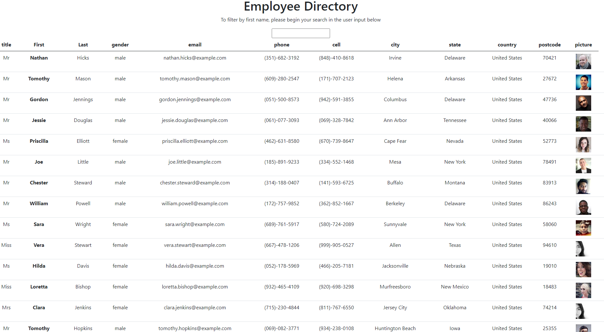

# employee_directory

# Homework-June-15

==================================================================================================

## Home assignment

Background:

This is Homework due on May 8. Practice of Create React App set up, Components, JSX variablesUser and Props. User able to view my entire employee directory at once so that I have quick access to their information.

---

Install

This project uses VS Code, GitBash, Mongo DataBase Atlas and NoSQL Please check you have correctly installed those program

Please ensure each of your program account created with SSH key or passwrod.

Please ensure running "npm i" to install all dependencies.

---

Usage （purpose）

This application will allow User able to view my entire employee directory at once so that I have quick access to their information.

Local App start: Please enter "node server" or "npm start" at your terminal. Please ensure installed all dependencies.

---

Contributing

for future reference

---

License

for future reference

---

## Review

You are required to submit BOTH of the following for review:

- The URL of the deployed application.
  https://murmuring-lake-21054.herokuapp.com/
- The URL of the GitHub repository that contains your code. Give the repository a unique name and include a README file that describes the project.
  https://github.com/sj212131/employee_directory

  
